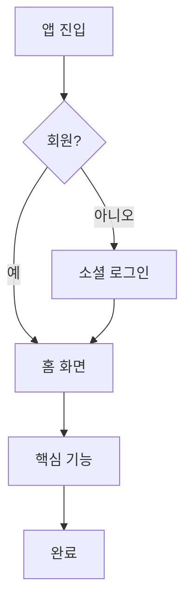

# /mvp Command Design Spec

> 대화형 기획 + 전문가 패널 보강으로 MVP 기획서를 만드는 커맨드

## 개요

`/mvp` 커맨드는 사용자와 대화로 아이디어를 구체화하고, 전문가 패널이 두 번 개입하여 방향성 검증 + 최종 보강을 수행한 뒤, 기획서와 플로우차트를 산출한다. 새 프로젝트와 기존 프로젝트 확장 모두 지원.

## 사용법

```bash
/mvp "반려동물 산책 매칭 앱"
/mvp "기존 서비스에 결제 기능 MVP 추가"
```

## 전체 플로우

```
/mvp "주제"
      │
      ▼
┌─── Phase 1: 대화형 기획 ───┐
│  질문-답변으로 윤곽 잡기      │
│  (타겟, 핵심기능, 제약조건)    │
└────────┬───────────────────┘
         ▼
┌─── Phase 2: 1차 전문가 검토 ──┐
│  "이 전문가를 투입합니다" 확인   │
│  → 전문가들이 방향성 검증       │
│  → 놓친 아이디어 제안           │
│  → 사용자 취사선택              │
└────────┬───────────────────────┘
         ▼
┌─── Phase 3: 기획 심화 ─────┐
│  전문가 피드백 기반 대화 이어감  │
│  MVP 스코프 확정             │
│  유저 플로우 확정             │
└────────┬───────────────────┘
         ▼
┌─── Phase 4: 기획 초안 작성 ──┐
│  기획서 + 플로우차트 생성      │
│  사용자에게 제시              │
└────────┬───────────────────┘
         ▼
┌─── Phase 5: 2차 전문가 보강 ──┐
│  기획 초안을 전문가들이 최종 검토 │
│  → 개선점/추가 아이디어 제안     │
│  → 사용자 취사선택              │
└────────┬────────────────────┘
         ▼
┌─── Phase 6: 최종 산출물 ────┐
│  기획서 확정 + 플로우차트 확정  │
│  docs/mvp/에 저장 + 커밋      │
└────────┬───────────────────┘
         ▼
┌─── Phase 7: 다음 단계 선택 ──┐
│  1. 화면 설계 (와이어프레임)    │
│  2. 기술 설계 (아키텍처/API/DB) │
│  3. 구현 (스캐폴딩+TDD+리뷰)   │
│  4. 여기서 끝                 │
└──────────────────────────────┘
```

## Phase 1: 대화형 기획

AI가 **한 번에 하나씩** 질문하며 아이디어를 구체화한다.

질문 가이드 (상황에 따라 추가/생략/순서 변경 가능):

1. "이 서비스를 한 문장으로 설명하면?" → 핵심 가치 파악
2. "타겟 사용자가 누구예요?" → 페르소나 정의
3. "사용자가 이 서비스에서 가장 먼저 하는 행동은?" → 핵심 유저 플로우 시작점
4. "비슷한 서비스나 레퍼런스가 있어요?" → 벤치마크 + 차별점
5. "MVP에서 반드시 있어야 하는 기능 3개만 뽑으면?" → 스코프 제한
6. "기술 스택 선호가 있어요? 없으면 추천해드림" → 기술 제약
7. "특별한 제약이 있어요? (예산, 기간, 플랫폼 등)" → 제약 조건

**규칙:**
- 질문은 고정 목록이 아님. 상황에 따라 유연하게 조정
- 답변이 모호하면 후속 질문으로 파고듦
- 답변 중 이미 다른 질문의 답이 나왔으면 스킵
- 충분히 이해됐다고 판단하면 Phase 2로 넘어감

## Phase 2: 1차 전문가 검토 (방향성 검증)

대화로 윤곽이 잡힌 시점에 전문가 패널을 투입한다.

### 전문가 선정

주제를 분석하여 적합한 전문가 3-5명을 추천. 사용자 확인 필수:

```
지금까지 내용 기반으로 전문가 검토를 돌리겠습니다.

| 전문가 | 투입 이유 |
|--------|---------|
| @expert-strategy | 비즈니스 모델 검증 |
| @expert-pm-planner | MVP 스코프 적절성 |
| @expert-ui-ux-designer | UX 관점 핵심 플로우 |

진행할까요? (추가/제거 가능)
```

### 전문가에게 전달하는 내용

- 서비스 한 문장 설명
- 타겟 사용자
- 핵심 기능 목록
- 제약 조건

### 전문가가 리턴하는 내용

- 방향성 의견 (찬성/우려)
- 놓친 기능/관점 제안
- MVP 스코프 조정 의견
- 최신 트렌드 기반 인사이트

### 결과 요약

```
## 1차 전문가 검토 결과

💡 전략 전문가: "구독 모델보다 건당 결제가 MVP에 적합"
💡 PM: "채팅은 MVP에서 빼고 매칭+예약에 집중 추천"
💡 UX: "온보딩 2단계면 충분, 소셜 로그인 필수"

→ 이 의견들 반영할까요? 취사선택 해주세요.
```

### 디스패치 방법

각 전문가를 Agent 도구로 병렬 호출 (기존 `/expert-panel`과 동일한 배치 전략):
- 1-5명: 동시 병렬
- 6+명: 5명씩 배치

## Phase 3: 기획 심화

1차 전문가 피드백 중 사용자가 채택한 내용을 반영하여 대화를 이어간다.

- 전문가가 제안한 새 아이디어에 대해 사용자와 논의
- MVP 스코프 최종 확정
- 유저 플로우 확정
- 충분히 구체화되면 Phase 4로 넘어감

## Phase 4: 기획 초안 작성

기획서와 플로우차트를 생성하여 사용자에게 제시한다.

### 기획서 형식

```markdown
# {서비스명} MVP 기획서

## 1. 서비스 개요
- 한 문장 설명
- 타겟 사용자
- 핵심 가치 (왜 이걸 써야 하는지)

## 2. MVP 스코프
### 포함 (Must-have)
- [ ] 기능 A — 설명
- [ ] 기능 B — 설명

### 제외 (Nice-to-have, 이후 버전)
- 기능 C — 이유
- 기능 D — 이유

## 3. 유저 플로우
### 메인 플로우
1. 사용자가 앱 진입
2. ...

### 서브 플로우
- 플로우 A: ...
- 플로우 B: ...

## 4. 전문가 인사이트
| 전문가 | 핵심 제안 | 반영 여부 |
|--------|---------|----------|
| 전략 | "..." | ✅ 반영 / ❌ 미반영 (사유) |

## 5. 제약 조건
- 기술 스택: ...
- 기간/예산: ...
- 플랫폼: ...

## 6. 성공 지표 (KPI)
- 지표 A: 목표값
- 지표 B: 목표값
```

### 플로우차트

Mermaid 문법으로 기획서에 포함:



## Phase 5: 2차 전문가 보강 (완성도 검증)

기획 초안 완성 후 전문가에게 최종 검토를 돌린다.

### 1차와 2차의 차이

| | 1차 (Phase 2) | 2차 (Phase 5) |
|---|---|---|
| 시점 | 윤곽만 잡힌 상태 | 기획 초안 완성 후 |
| 목적 | 방향성 검증 + 아이디어 | 완성도 검증 + 보강 |
| 깊이 | 가볍게 (의견 수준) | 깊게 (기획서 전체 리뷰) |
| 전달 내용 | 요약 정보 | 완성된 기획서 + 플로우차트 전문 |

### 전문가에게 전달하는 내용

- 완성된 기획서 전문
- 플로우차트

### 전문가가 리턴하는 내용

- 기획서 구멍 (빠진 시나리오, 엣지 케이스)
- 추가 아이디어
- 우선순위 조정 제안
- 트렌드 기반 개선점

### 전문가 선정

1차와 동일하거나 변경 가능. 사용자 확인 필수.

## Phase 6: 최종 산출물

사용자가 2차 전문가 피드백을 취사선택한 뒤 기획서를 확정한다.

### 저장 위치

```
docs/mvp/{서비스명}-기획서.md
```

확정 후 git 커밋.

## Phase 7: 다음 단계 선택

```
기획서가 확정되었습니다. 다음으로 뭘 할까요?

1. 📱 화면 설계 — 와이어프레임 수준 화면 구성
2. 🏗️ 기술 설계 — 아키텍처, DB 스키마, API 설계
3. 🚀 구현 — 스캐폴딩 + TDD 구현 + 코드 리뷰
4. ✅ 여기서 끝 — 기획서만 가져갈게요
```

| 선택 | 동작 |
|------|------|
| 화면 설계 | 기획서 기반 와이어프레임 생성, 완료 후 다시 메뉴 |
| 기술 설계 | 기획서 기반 아키텍처+API+DB 설계서 생성, 완료 후 다시 메뉴 |
| 구현 | writing-plans 스킬로 전환하여 구현 플랜 생성 → 실행 |
| 끝 | 종료 |

복수 선택 가능 — 순차적으로 진행.

## 구조

```
commands/
  mvp.md                    ← 커맨드 파일 (오케스트레이터)

docs/mvp/
  {서비스명}-기획서.md        ← 산출물
```

기존 `/expert-panel` 커맨드의 전문가 디스패치 로직과 `skills/expert-panel/references/panels.md`의 별칭 매핑을 그대로 활용한다.
